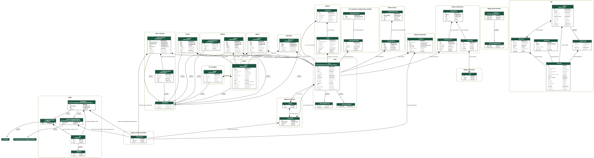

# 대동먹지도
**목차**
- [서비스 소개](#서비스-소개)
- [서비스 기획 의도](#서비스-기획-의도)
- [메인 기능](#메인-기능)
- [팀원 참여 소감](#팀원-참여-소감)
- [사이트 구조 개요](#사이트-구조-개요)
- [디비 스키마 구조](#디비-스키마-구조)
- [API 구조](#API-구조)
- [프론트엔드 구조](#프론트엔드-구조)
- [배포 방식](#배포-방식)

 

## 서비스 한줄 소개
대동먹지도에 여러분들만 알고 있는 먹거리를 소개해주세요.

## 서비스 기획 의도

`대동먹지도`는 흔한 음식점 리뷰 사이트 아이디어에서 시작하지 않았습니다.

`대동먹지도`는 델리만쥬, 호떡, 순대트럭, 길거리 음식들 등의 정말 `사소한 음식들`도 여러 사용자들이 `"어디 있는지"`, `"언제 여는지"` 그리고 `"맛은 있는지"` 등의 정보를 알고 싶다는 니즈에서 시작했습니다.

지도에서 주변 먹거리의 정보들을 확인하고, 여러 부류의 원하는 음식들의 정보를 검색해볼 수 있는 서비스를 기획하고자 했습니다.

이후 사용자는 제보, 리뷰, 신고 등을 통한 리워드를 받게 되어 더 많은 정보가 공유될 수 있게 기획하였고, 이를 통해 더 많은 음식 부류가 공유되는 서비스가 될 수 있게 기획하였습니다.

## 메인 기능
대동먹지도의 기능은 크게 5가지가 있습니다.
`제보`, `지도`, `검색`, `리뷰`, `신고`입니다.

`"제보 기능"`은 서비스 사용자가 알고있는 사소하고, 다양한 먹거리들을 제보받는 기능입니다.

`"지도 기능"`은 여러 서비스 이용자들이 제보한 장소들을 관리자가 추합/검수하여, 지도 상에서 표시해주는 기능입니다.

`"검색 기능"`은 서비스 이용자들이 보다 편하게 원하는 정보를 접할 수 있게 해주는 기능입니다.

`"리뷰 기능"`은 잘못된 제보/장소/먹거리에 대해 선순환적인 피드백을 할 수 있는 창구이며, 서비스 이용자들의 다양한 의견을 공유할 수 있는 기능입니다.

`"신고 기능"`은 운영진에게 제보/장소에 대한 정보 등의 정정이나, 삭제 요청을 할 수 있는 기능입니다.

## 팀원 참여 소감

### 김신건

길면서 짧은 기간동안 아이디어를 구상/기획/개발/디자인/테스트를 모두 진행해준 팀원들이 너무 고생한 것 같습니다.

"아이디어 없이 일단 팀원 구함"을 카카오톡 단체 톡방에 말했을 때, 이 능력없는 팀장을 믿고 팀에 들어와준 팀원들에게 너무 감사합니다.

이전에 Django 그 자체를 이용해 웹 서비스를 개발한 적은 많았지만 Django-Rest-Framework와 React.js의 조합을 모두 경험하면서 개발해본 적은 없었습니다.

이 때문에 많은 시행착오도 겪었고, 기획으로만 남은 기능도 아직 많이 남아있습니다. 기회가 된다면, 이후 서비스를 조금 다듬어서 재배포를 하고 싶습니다.

Heroku와 Netlify를 이용해 배포하였기에, 배포 과정 자체는 간단하게 할 수 있었으나, 성능이 너무 떨어지는 모습이 보여 아까웠기 때문입니다. 이후에는 EC2 이미지를 교체해나가며 배포하며, RDS를 통해 DB를 구축하는 방법 등으로 서비스를 안전하고 빠르게 개선하고 싶습니다.

### 김민정

### 이기정

이번 해커톤은 식어있던 저의 열정에 기름을 붓는 동기가 되었습니다. 

개발초기에는 django와 react.js 를 이용해서 프로젝트를 진행해본적이 처음이여서 개발하는데 많은 어려움을 겪었습니다. 
하지만 어떻게든 완성해야한다는 생각과 프로젝트의 열정이 합처져서 열심히 알아보고 개발을 이어나갔습니다.

생각해보면 되게 짧은 시간안에 괜찮은 퀄리티의 웹사이트가 나온 것 같아 만족하지만 아직 부족한 부분도 많고 개선해야할 점도 많아서 아쉽습니다.
저와 열정적으로 프로젝트를 같이 진행한 팀원분들에게 감사합니다! 

### 이승환

멋쟁이사자처럼에 들어와서 웹개발에 대한 전체적인 흐름을 배우고 아이디어톤을 마치고,
좋은 기회로 좋은 팀장, 팀원분들이 있는 팀에서 프로젝트를 진행할 수 있어서 좋았습니다.

Django 로 웹 서비스를 개발한 적은 있었지만, 존재 여부만 알고 있었던 Django-Rest-Framework 를 처음으로 사용해보며 알고 있는 지식을 사용하여 프로젝트를 진행하는 것에서 멈추지 않고, 항상 배워가며 프로젝트를 진행하게 된다는 이점을 다시 한번 느낄 수 있었습니다.

또한, 팀장, 팀원들로부터 깃플로우를 사용한 효과적인 협업 방식을 배우고 해당 방식을 따라
협업을 진행하는 모습이 인상깊었습니다.
## 사이트 구조 개요

**대동먹지도** 는 프론트엔드와 백엔드가 따로 분리되어 있는 구조입니다.

프론트엔드는 `React.js` 로 개발되었습니다.
백엔드는 `Django` 로 개발되었으며, `django-rest-framework` 를 이용한 API 서버로 구성되어있습니다.

## 디비 스키마 구조
### 서비스 모델 스키마

### 전체 모델 스키마

## API 구조

아래 API docs 사이트를 통해 쉽게 확인하실 수 있습니다.
### Swagger
- [Swagger](https://daedong-food-map-api.herokuapp.com/swagger/)

- 

### Redoc
- [Redoc](https://daedong-food-map-api.herokuapp.com/redoc/)

- 
## 프론트엔드 구조

### 디렉토리 구조

|디렉토리명|역할|
|-|-|
| components | 사이트에 사용되는 컴포넌트들을 목적단위로 분리해두는 디렉토리입니다.|
|config| Webpack, Jest 등을 활용하기 위한 설정을 모아두는 디렉토리입니다.|
|fonts| 사이트에서 사용되는 폰트 파일들을 모아두는 디렉토리입니다.|
|hooks| 공통적으로 사용되는 커스텀 훅을 모아두는 디렉토리입니다.|
|layouts| 사이트의 레이아웃 컴포넌트를 모아두는 디렉토리입니다.|
|pages| 사이트 상의 페이지를 나타내는 컴포넌트를 모아두는 디렉토리입니다.|
|reducers| 목적단위로 state들을 따로 분리하고, 이를 관리하는 reducer들을 모아두었습니다. |
|sagas| redux-saga를 이용해 action들을 watch하고, 작업을 수행하는 목적단위로 파일들을 분리하여 모아두었습니다. |
|store| react-redux 스토어를 정의하는 파일을 분리해두는 디렉토리입니다.|
|styles| stylesheet를 모아두는 디렉토리입니다. |

### Redux & Redux-Saga

### 카카오맵
[Kakao developer](https://developers.kakao.com/)에 로컬url과 도메인url을 등록해서 api key를 발급받아 이용했습니다.(1일 최대 30만번 까지는 무료이용이 가능했습니다.)

[Kakao Map](https://apis.map.kakao.com/web/guide/)를 참고해서 진행했습니다.

## 배포 방식

#### 백엔드
[heroku](https://www.heroku.com/)를 활용하여 자동 배포를 진행합니다.

프론트엔드와 백엔드가 같은 레포에서 관리되므로, git subtree를 만들어 배포합니다.

#### 프론트엔드

[netlify](https://www.netlify.com/)를 활용한 배포를 진행합니다.

프론트엔드 폴더 상에서 nerlify command를 이용해 배포합니다.

## Links

* [웹사이트](https://daedong-food-map.netlify.app/)
* [이슈 트래커](https://github.com/likelion-kookmin/daedong-food-map/issues)
* [소스코드](https://github.com/likelion-kookmin/daedong-food-map)
